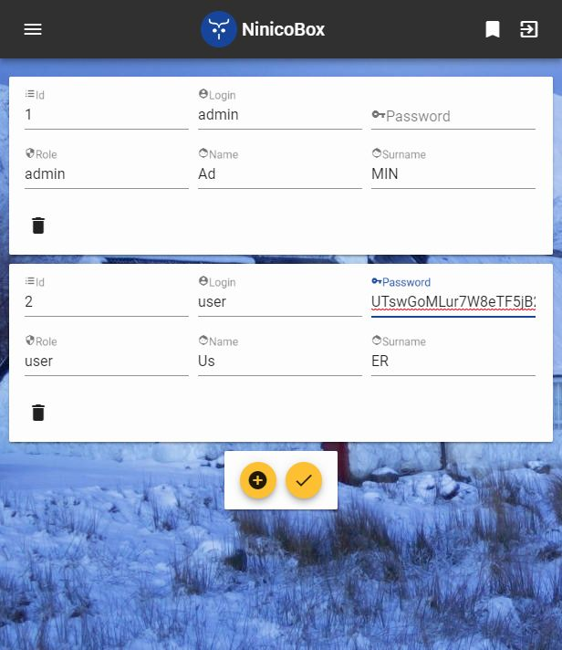

# ninicobox-v3-deploy

Deployment for Ninicobox.
A home cloud providing file explorer with permissions and access control lists to share files with friends, and acting as a proxy for other services with JWT securing.

File explorer use webdav, so webdav shares can be mounted as filesystems.

## Clone the repository, get submodules and checkout to master branch

```bash
git clone https://github.com/nicolaspernoud/ninicobox-v3-deploy.git
cd ninicobox-v3-deploy
git submodule update --init --recursive --remote
git submodule foreach --recursive git checkout master
```

## Run in developpment mode

```bash
# Start the server (or use vs code debug config)
cd ninicobox-v3-server
go run main.go -debug -framesource=https://box.127.0.0.1.nip.io:4443 -https_port=2443 -hostname=box.127.0.0.1.nip.io
# Start the client in another terminal
cd ninicobox-v3-client
npm install
npm start
```

Visit https://box.127.0.0.1.nip.io:4443 to try the app (login: admin ; password: password)

## Run with docker

```bash
docker-compose up
```

## Screen captures


